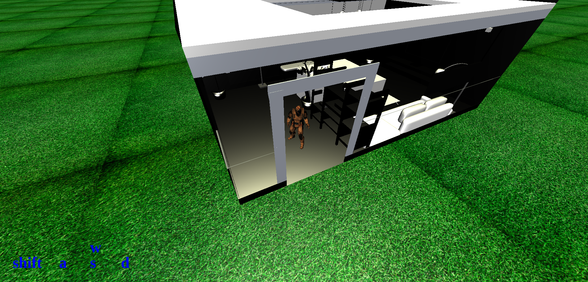

# Fun Game on three.js (version 0.2)

**T**his is just a test game using typescript, three.js and webpack :)

## development

```bash
# install dependencies
npm i
# compile server
npm run generate
# compile frontend and watching for change...
npm run dev
```
then open `http://localhost:8800/` on your browser

## screenshots




## For Debug
https://gist.github.com/wtho/8a8924481763dc671c67b8868e54b695