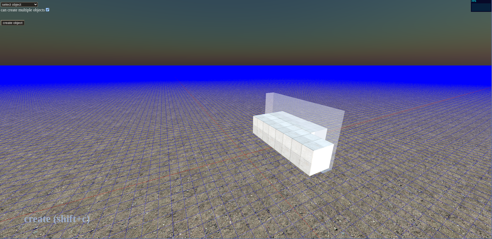

# Fun Game on three.js (version 0.6)

**T**his is just a test game using typescript, three.js and webpack :)

## development

```bash
# install dependencies
npm i
# compile server
npm run generate
# compile frontend and watching for change...
npm run dev
```
then open `http://localhost:8800/` on your browser

## screenshots




## game modes

### view mode `shift+v`
just view the zone!

### edit mode `shift+e`
select an object by cursor or search input, then show controls on target object to edit it:
- `T key`: translate (move) object
- `R key`: rotate object
- `S key`: scale object
- `+ key`: increase size of control
- `- key`: decrease size of control

> if you press `N key` you can use snap on your translate, rotate, scale actions
### create mode `shift+c`
select an object type from select box on top corner of window, then click on *create object* button and now you can add your object on the zone.
### delete mode `shift+d`
choose an object, can delete it!

## main object types

- wall
- glass

## character controls

use `W`, `S`, `A`, `D` keys to walk and you can press `Shift` key to run.
## For Debug
https://gist.github.com/wtho/8a8924481763dc671c67b8868e54b695